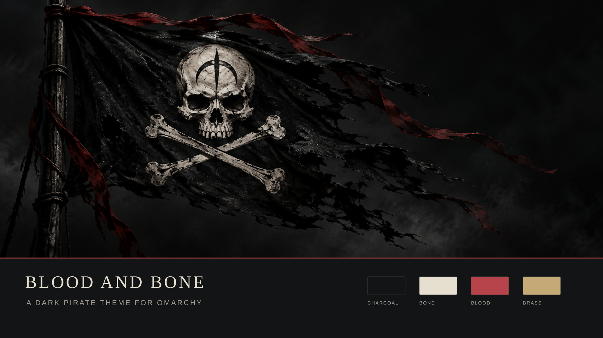

# Blood and Bone

An ominous pirate theme for Omarchy: charcoal seas, bone-white lettering and blood-red accents, with the quiet warmth of antique brass and parchment.



*Wallpaper and palette preview, not a desktop screenshot.*

Inspired by the atmosphere of **A General History of the Robberies and Murders of the Most Notorious Pyrates**, classic pirate fiction and moonlit maritime adventure.

## Palette

| Role | Color |
| --- | --- |
| Charcoal background | `#121416` |
| Deep black | `#090b0d` |
| Bone foreground | `#e6dfcf` |
| Blood-red accent | `#b8444b` |
| Dark red selection | `#49282d` |
| Antique brass | `#c5aa77` |
| Weathered iron border | `#393b3d` |

Muted green, blue, cyan and rose preserve useful terminal and syntax distinctions. Menus use bone-white selected text over dark red; brass and parchment remain secondary accents.

## Install

On a current Omarchy installation:

```sh
omarchy theme install https://github.com/c8h10n4o2-b/omarchy-blood-and-bone-theme
```

Or open **Install → Style → Theme** in the Omarchy menu and paste the repository URL. Installation selects the theme immediately. It appears as **Blood And Bone** in the theme selector.

**Already have a local theme named `blood-and-bone`?** Back it up before installing: Omarchy's installer replaces an existing directory with the same name. Keep personal changes in a separate custom theme or backed up elsewhere.

To select it again:

```sh
omarchy theme set blood-and-bone
```

## Update

Update installed Git themes, then regenerate and apply this theme:

```sh
omarchy theme update
omarchy theme set blood-and-bone
```

The first command updates all installed Git themes. To update only this one instead:

```sh
git -C "$HOME/.config/omarchy/themes/blood-and-bone" pull --ff-only
omarchy theme set blood-and-bone
```

## Wallpapers

Eight final pirate backgrounds are included, unchanged from the completed theme. Each PNG is **1916 × 821**. Displays with a different aspect ratio may crop the image; larger displays scale it up.

| File | Scene |
| --- | --- |
| [01-omarchy-pirate-flag.png](backgrounds/01-omarchy-pirate-flag.png) | Weathered flag; default background |
| [02-black-flag-minimal.png](backgrounds/02-black-flag-minimal.png) | Minimal black flag |
| [03-moonlit-smugglers-cove.png](backgrounds/03-moonlit-smugglers-cove.png) | Moonlit smugglers' cove |
| [04-pirate-fortress-harbor.png](backgrounds/04-pirate-fortress-harbor.png) | Fortress harbor |
| [05-cartographers-black-map.png](backgrounds/05-cartographers-black-map.png) | Dark cartography |
| [06-ghost-ship-in-a-storm.png](backgrounds/06-ghost-ship-in-a-storm.png) | Ghost ship in a storm |
| [07-treasure-map-tabletop-clean-layout.png](backgrounds/07-treasure-map-tabletop-clean-layout.png) | Treasure-map tabletop |
| [08-kraken-rising.png](backgrounds/08-kraken-rising.png) | Kraken rising |

Use Omarchy's background picker or cycle with:

```sh
omarchy theme bg next
```

## Compatibility and design

Packaged for **Omarchy 4.0.4-1** and its current palette-driven Quickshell theme system. Earlier releases with different theme schemas are not tested.

- `colors.toml` supplies the palette and Hyprland border colors.
- `shell.launcher.toml` and `shell.menu.toml` are supported section overrides for the completed theme's menu treatment.
- Omarchy generates terminal, Hyprland, editor and other supported application configurations from its own templates. The shell palette covers the bar, notifications, popups and lockscreen.
- No executable scripts, Lua, terminal configuration overrides, plugins, fonts or additional icon packages are required.
- No Omarchy-managed files, global templates, monitor configuration or user hooks need modification.

Reapply the theme after an Omarchy update to regenerate application files using the updated templates. Personal user templates and hooks can affect appearance. The normal Omarchy lockscreen layout is retained; no custom unlock image is provided.

## Remove or switch back

Choose a different installed theme first. For example, to switch to Catppuccin and remove Blood and Bone:

```sh
omarchy theme set catppuccin
omarchy theme remove blood-and-bone
```

To restore a particular previous appearance, select that theme and use `omarchy theme bg set` with your saved wallpaper path. This repository does not install hooks or edit upstream configuration, so no additional configuration cleanup is required.

## Attribution and license

Theme packaged and published by **c8h10n4o2-b**. The palette and shell styling were developed with AI assistance; the final wallpaper collection was supplied by the maintainer for this theme, including the generated Omarchy Pirate Flag. The preview combines that unchanged flag image with the theme's name and palette.

The repository is distributed under the [MIT License](LICENSE), covering the theme files, documentation and supplied artwork to the extent of the maintainer's rights. No trademark rights are granted. Omarchy and referenced literary or entertainment properties remain associated with their respective owners; this is an independent community theme, not an official or endorsed release. No third-party wallpaper attribution was supplied with the final collection.

## Theme registry

Prepared for the [Omarchy Theme Registry](https://github.com/omacom/omarchy-theme-registry): conventional repository name, root palette, descriptive backgrounds, a 1920 × 1080 preview, README, license and repository topics. Registry submission is separate from installation; this project has not been submitted by its packaging workflow.

See the [official Omarchy theme guide](https://omarchy.org/manual/making-your-own-theme/) for the current distribution and template conventions.
