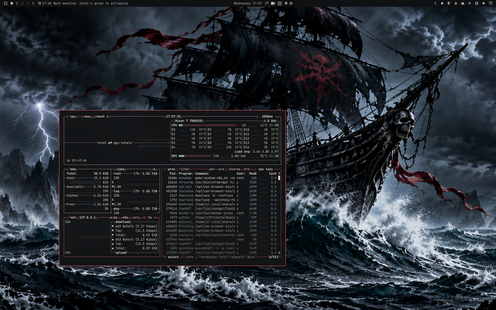
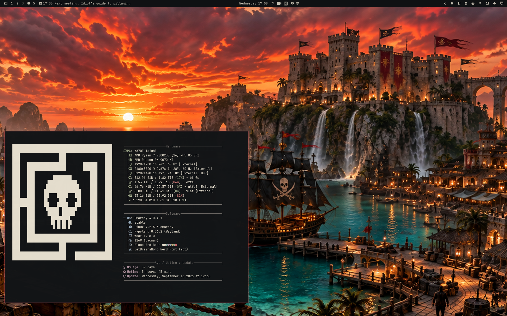

# Blood and Bone in use

Reference screenshots supplied by the maintainer, preserved at their original resolution. Click an image to inspect the full-size file.

These show a customized desktop. Application layouts, transparency, widgets and additional application integrations can differ from a standard theme installation. The skull About logo is an [optional customization](../extras/about/README.md).

## Ghost ship and system monitor

Blood-red window borders and the themed btop system monitor over the Ghost Ship in a Storm wallpaper.

## Fortress harbor and skull About logo

The Pirate Fortress Harbor wallpaper with the optional bone-white skull About customization.

